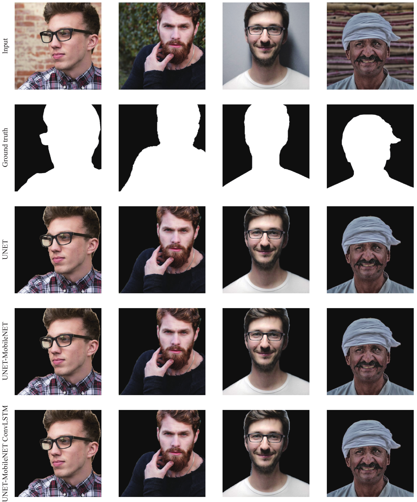

### Deep learning for Real Time Background Replacement of Video
---

#### Abstract: 

Background replacement is one of the most used features in video conferencing applications by many people, perhaps mainly for privacy protection, but also for other purposes such as branding, marketing and promoting professionalism. However, the existing applications in video conference tools have serious limitations. Most applications tend to generate strong artefacts (while there is a slight change in the perspective of the background), or require green screens to avoid such artefacts, which results in an unnatural background or even exposes the original background to other users in the video conference. In this work, we aim to study the relationship between the foreground and background in real-time videos. Three different methods are presented and evaluated, including the baseline U-Net, the lightweight U-Net MobileNet, and the U-Net MobileNet&ConvLSTM models. The above models are trained on public datasets for image segmentation. Experimental results show that both the lightweight U-Net MobileNet and the U-Net MobileNet& ConvLSTM models achieve superior performance as compared to the baseline U-Net model.

#### Result


*Results on the Kaggle Person Segmentation dataset[^1].*

#### How to Cite
```
@article{Shahi_Li_2023, 
  title={Background replacement in video conferencing},
  volume={2},
  DOI={10.53941/ijndi.2023.100004},
  number={2},
  journal={International Journal of Network Dynamics and Intelligence}, 
  author={Shahi, Kiran and Li, Yongmin}, 
  year={2023}, 
  month={Jun},
  doi = {https://doi.org/10.53941/ijndi.2023.100004},
  url = {https://www.sciltp.com/journals/ijndi/issue18-paper256.html}
  } 
```
[^1]: https://www.kaggle.com/datasets/nikhilroxtomar/person-segmentation
